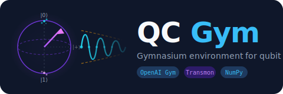

<p align="center">
  
</p>

<h3 align="center">Gymnasium environment for qubit calibration</h3>

<p align="center">
  <a href="https://gymnasium.farama.org/"></a>
  <a href="https://numpy.org/"></a>
  <a href="https://www.uvicorn.org/"></a>
  <a href="LICENSE"></a>
</p>

---

**QC Gym** simulates a superconducting transmon qubit with a hidden set of
physical parameters. An agent must discover those parameters by designing and
running experiments — exactly as a physicist would in the lab.

The gym supports **two agent paradigms**:

| | RL Agent | Coding Agent |
|---|---|---|
| Interface | Gymnasium `step()` | HTTP API (`curl` / `httpx`) |
| Example | `examples/random_agent.py` | Claude Code + `CLAUDE.md` |
| How it works | 5-D continuous action space | Named experiments, JSON responses |
| Training needed | Yes | No — uses pretraining |

---

## Coding Agent Quick Start ✨

> Run Claude Code (or any LLM agent) as a blind calibration scientist.
> The agent gets an HTTP API and 30 experiment calls. True parameters are hidden.


**Terminal 1 — start the qubit server:**

```bash
git clone https://github.com/Osgood001/quantum-cal-gym.git
cd quantum-cal-gym
pip install -e ".[server]"
uvicorn quantum_cal_gym.server:app --port 8765
```

**Terminal 2 — give Claude Code its task and let it run:**

```bash
# Create an isolated workspace — no gym source visible to the agent
mkdir ~/qcal-agent && cd ~/qcal-agent

# Copy the task description (becomes the agent's CLAUDE.md)
cp /path/to/quantum-cal-gym/docs/CLAUDE_AGENT.md CLAUDE.md

claude    # Claude Code reads CLAUDE.md and calibrates autonomously
```

Claude Code will create a session, run experiments iteratively, reason about
the physics, and submit its final parameter estimates — no training required.

**Watch the session live** in `runs/server_sessions/{sid}/`:

| File | Contents |
|------|----------|
| `step_NNN_<exp>.png` | Signal + IQ plot with true-value reference line |
| `log.json` | Structured record of every experiment call |
| `progress.png` | Timeline regenerated after each step |

---

## RL Agent Quick Start

```bash
git clone https://github.com/Osgood001/quantum-cal-gym.git
cd quantum-cal-gym
pip install -e .
python examples/random_agent.py
```

```python
import gymnasium as gym
import quantum_cal_gym

env = gym.make("QubitCalibration-v0")
obs, info = env.reset()

for _ in range(50):
    action = env.action_space.sample()
    obs, reward, terminated, truncated, info = env.step(action)
    if terminated:
        break

env.close()
```

---

## Why Coding Agents?

```
┌─────────────────────────┐        HTTP        ┌──────────────────────────┐
│   Coding Agent          │◄──────────────────►│  quantum_cal_gym/server  │
│  (Claude Code, GPT-4o…) │  POST /session/run  │  FastAPI + TransmonSim   │
│                         │  POST /session/sub  │  EpisodeLogger           │
└─────────────────────────┘                     └──────────────────────────┘
         reasons, plans,                           true params hidden;
         fits curves,                              plots + log.json saved
         adapts strategy                           to runs/server_sessions/
```

- **Zero training.** Coding agents bring physics knowledge, curve-fitting
  intuition, and adaptive planning from pretraining.
- **The gym becomes a benchmark.** How many parameters in 30 shots? Does the
  agent zoom in on resonances? Does it set Ramsey detuning correctly?
- **Minimal interface by design.** The server exposes only signal data.
  The agent must reason from first principles — just like a real experimentalist.

The server uses the same `EpisodeLogger` as the Gymnasium env, so all output
(plots, log, progress chart) is produced by shared infrastructure.

---

## Environment: `QubitCalibration-v0`

### Action Space

| Index | Name | Range | Maps to |
|-------|------|-------|---------|
| 0 | `exp_type` | [0, 1] | Experiment: 0=S21, 1=Spectrum, 2=PowerRabi, 3=TimeRabi, 4=T1, 5=Ramsey |
| 1 | `sweep_center` | [0, 1] | Frequency centre or Ramsey detuning (normalised) |
| 2 | `sweep_span` | [0, 1] | Frequency span or maximum time (normalised) |
| 3 | `amplitude` | [0, 1] | Drive amplitude |
| 4 | `delay_frac` | [0, 1] | Maximum delay for time-domain experiments |

### Observation Space

| Key | Shape | Type | Description |
|-----|-------|------|-------------|
| `signal_re` | `(64,)` | `float32` | Real part of measured IQ signal |
| `signal_im` | `(64,)` | `float32` | Imaginary part |
| `x_axis` | `(64,)` | `float32` | Sweep axis values, normalised to [0, 1] |
| `state` | `(9,)` | `float32` | Parameter estimates + calibration progress |

### Reward

+1 per newly calibrated parameter (within 5 % of true value), −0.02 per step, +10 on full calibration.

---

## Project Structure

```
quantum-cal-gym/
  quantum_cal_gym/
    __init__.py      # Gymnasium registration
    cal_env.py       # QubitCalibrationEnv (RL interface)
    qubit_sim.py     # Transmon physics: scqubits + QuTiP + Ctoolbox
    server.py        # FastAPI server for coding-agent sessions
    logger.py        # EpisodeLogger: step PNGs + log.json + progress.png
    mock_quark.py    # Drop-in stub for the lab quark SDK
  examples/
    random_agent.py  # RL smoke test / demo
  docs/
    report.md        # Technical report (Chinese, with physics derivations)
    CLAUDE_AGENT.md  # CLAUDE.md template for the coding-agent workspace
  pyproject.toml
  logo.svg
```

---

## Physics Model

The simulator models a single transmon qubit with dispersive readout:

- **S21** — complex Lorentzian transmission centred at resonator frequency `f_r`
- **Spectrum** — qubit absorption dip at `f_q`, linewidth `1/(π T2*)`
- **PowerRabi** — sinusoidal population oscillation vs drive amplitude
- **TimeRabi** — sinusoidal oscillation with T1 decay envelope
- **T1** — exponential population decay `exp(−t/T1)`
- **Ramsey** — Gaussian-damped cosine `A·exp(−t/2T1 − t²/T2r²)·cos(2π·Δf·t)`

Hidden parameters drawn at each `reset()`:

| Parameter | Range | Description |
|-----------|-------|-------------|
| `f_q` | 4 – 7 GHz | Qubit frequency |
| `f_r` | `f_q` + 0.5 – 1.5 GHz | Readout resonator |
| `T1` | 10 – 200 µs | Energy relaxation |
| `T2*` | 5 – 200 µs | Dephasing time |
| `amp_pi` | 0.3 – 0.9 | π-pulse amplitude |
| `t_pi` | 20 – 200 ns | π-pulse duration |

---

## Mock quark SDK

`mock_quark.py` provides a drop-in stub for the proprietary `quark` lab SDK so notebook-style experiment code can run offline:

```python
from quantum_cal_gym.mock_quark import install
install()   # injects quark.app into sys.modules

from quark.app import Recipe, s
s.login()

rcp = Recipe("T1")
rcp["delay"] = np.linspace(0, 200e-6, 64)
result = rcp.run()
```

---

## Motivation

Quantum processor calibration is bottlenecked by expensive hardware time. A physics-based simulation environment enables fast, low-cost development of:

- **RL agents** learning optimal calibration strategies
- **Coding agents** applying reasoning and physics knowledge without training
- **Benchmarking** autonomous calibration systems end-to-end

Inspired by [fib-gym](https://github.com/Osgood001/fib-gym), [ChemGymRL](https://docs.chemgymrl.com/), and [qualibrate](https://github.com/qua-platform/qualibrate).

## Roadmap

- [x] `QubitCalibration-v0` — single-qubit, 6 experiment types
- [x] Physics backend — scqubits (EJ/EC→f_q) + QuTiP Lindblad solver
- [x] FastAPI server + `EpisodeLogger` for coding-agent sessions
- [ ] Flux-tunable qubit (f_q vs bias curve)
- [ ] Two-qubit experiments (CZ, iSWAP)
- [ ] Real hardware backend via `quark` SDK
- [ ] `pip install quantum-cal-gym` (PyPI package)

## License

MIT — see [LICENSE](LICENSE).
