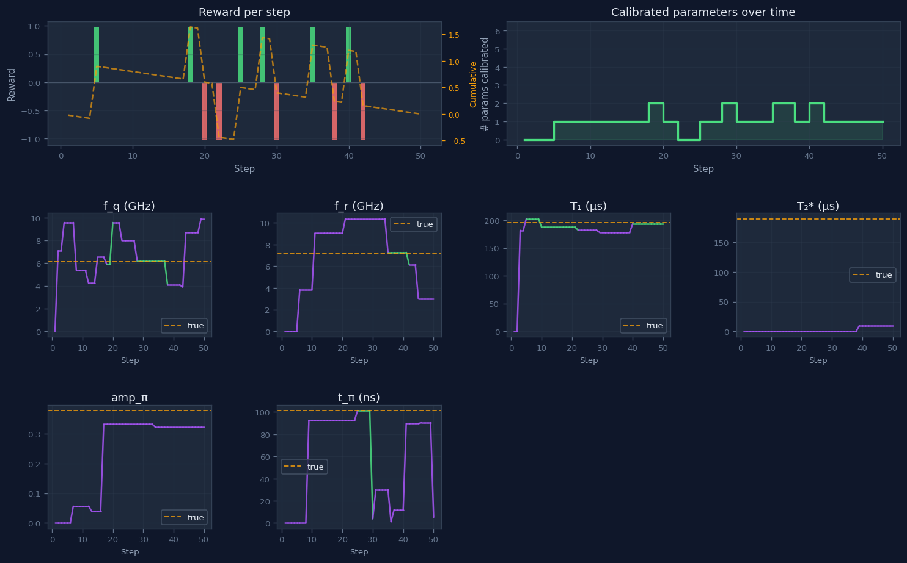
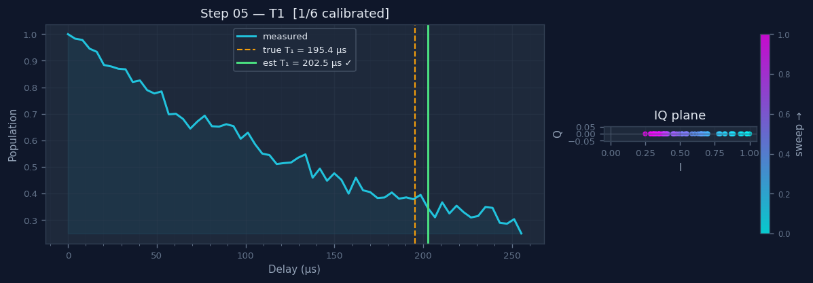
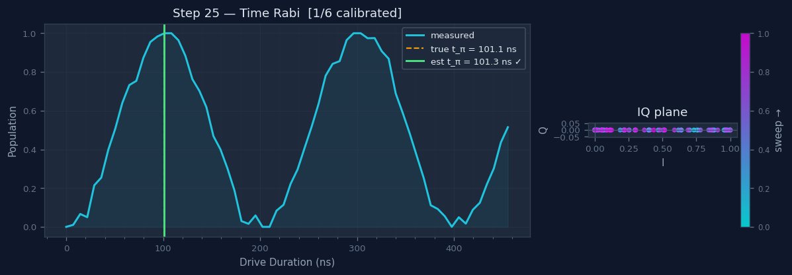
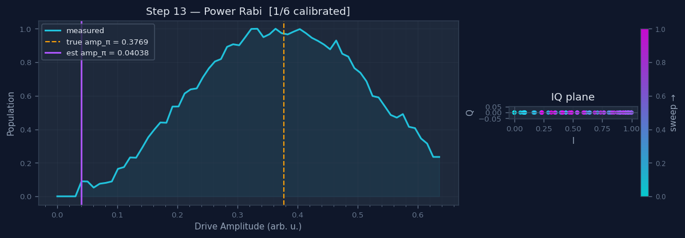
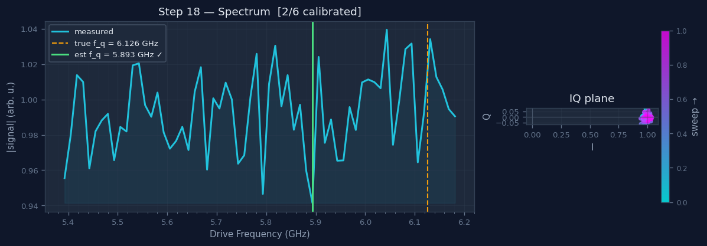
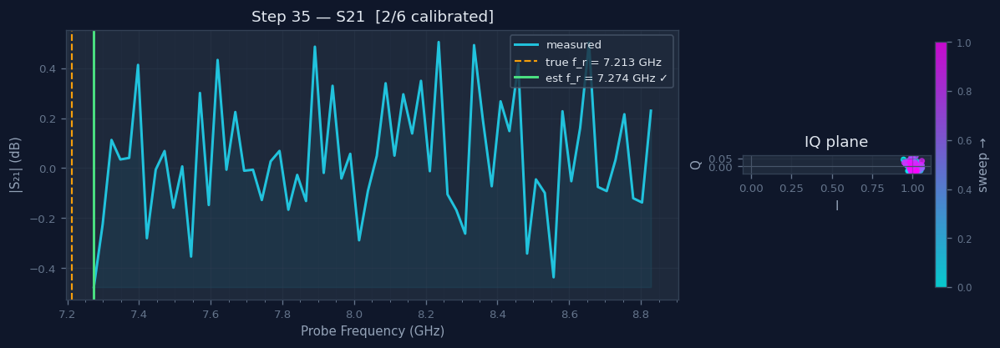
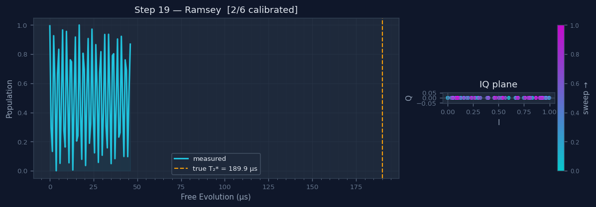

# 超导量子比特标定仿真平台技术报告

**量子计算实验室 · 内部技术文档**
**平台版本：** QubitCalibration-v0
**物理后端：** scqubits 4.3.1 + QuTiP 5.2.3 + Ctoolbox 对齐模型

---

## 一、背景与动机

### 1.1 超导量子比特的标定问题

在超导量子计算中，每个量子比特（qubit）在制备完成后都需要经历一套精确的**标定流程**，才能用于量子算法实验。标定的目标是确定以下关键参数：

| 参数 | 符号 | 典型值 | 物理含义 |
|------|------|--------|---------|
| 量子比特频率 | $f_q$ | 4–7 GHz | 基态到第一激发态的跃迁频率 |
| 读取谐振腔频率 | $f_r$ | $f_q + 0.5$–$1.5$ GHz | 色散耦合读取腔的共振频率 |
| 能量弛豫时间 | $T_1$ | 10–200 µs | 激发态 $|1\rangle$ 自发辐射到 $|0\rangle$ 的特征时间 |
| 相干时间 | $T_2^*$ | 5–200 µs | 量子相干性在自由演化下的保持时间 |
| $\pi$ 脉冲幅度 | $A_\pi$ | 0.3–0.9（归一化）| 驱动量子比特从 $|0\rangle$ 翻转到 $|1\rangle$ 所需的脉冲幅度 |
| $\pi$ 脉冲时长 | $t_\pi$ | 20–200 ns | $\pi$ 脉冲的持续时间 |

目前实验室采用 16×7 阵列（112 个量子比特）芯片，人工逐一标定耗时极大。因此，本项目旨在构建一个基于 **Gymnasium** 接口的仿真环境，为开发**自主标定强化学习智能体**提供训练平台。

### 1.2 设计目标

- **物理真实性**：采用 scqubits 进行约瑟夫森结参数化，QuTiP 求解 Lindblad 主方程，实验信号模型与 Ctoolbox 完全对齐。
- **离线可用性**：通过 `mock_quark` 模块模拟真实 quark SDK 接口，无需连接实验硬件即可开展智能体开发。
- **可视化调试**：每步实验自动保存 IQ 信号图和全局进度图，便于分析智能体行为。

---

## 二、物理模型

### 2.1 Transmon 量子比特

超导量子比特中最常用的设计是 **Transmon**，其哈密顿量为：

$$\hat{H} = 4E_C(\hat{n} - n_g)^2 - E_J \cos\hat{\varphi}$$

其中 $E_C = e^2/(2C_\Sigma)$ 为充电能，$E_J$ 为约瑟夫森能，$n_g$ 为感应栅极电荷。在 Transmon 极限（$E_J/E_C \gg 1$）下，充电噪声被强烈抑制，量子比特频率近似为：

$$f_q \approx \frac{\sqrt{8 E_J E_C} - E_C}{h}$$

本仿真平台通过 **scqubits** 库精确计算本征值，直接给出 $E_{01}/h$，而非使用上述近似公式。参数范围取实验室典型值：

$$E_J \in [10, 22]\ \text{GHz},\quad E_C \in [0.20, 0.35]\ \text{GHz}$$

对应量子比特频率范围约为 4–7 GHz，非谐性 $\alpha = f_{12} - f_{01} \approx -E_C \approx -200$–$-350$ MHz。

### 2.2 色散读取

量子比特通过**色散耦合**与读取谐振腔相互作用。色散近似（$g \ll |\Delta|$）下，系统哈密顿量化简为：

$$\hat{H}_\text{eff} = \hbar(\omega_r + \chi \hat{\sigma}_z)\hat{a}^\dagger \hat{a} + \frac{\hbar\omega_q}{2}\hat{\sigma}_z$$

其中 $\chi$ 为色散频移。当量子比特处于 $|0\rangle$ 或 $|1\rangle$ 态时，谐振腔有效频率分别为 $\omega_r \pm \chi$，使得通过测量谐振腔的传输幅度（S21）即可读取量子比特状态。

谐振腔传输曲线采用 **Ctoolbox 线性谐振腔模型**：

$$S_{21}(f) = 1 - \frac{Q/Q_e}{1 + 2iQ(f - f_0)/f_0}$$

其中 $Q = (Q_\text{int}^{-1} + Q_\text{ext}^{-1})^{-1}$ 为负载品质因子，$Q_e = Q_\text{ext}$ 为外耦合品质因子，谐振腔线宽 $\kappa = f_r/Q$。

### 2.3 退相干机制

量子比特的退相干由两类机制主导：

**（1）能量弛豫（$T_1$ 过程）：**

量子比特与环境的耦合导致激发态以指数衰减自发辐射：

$$P_{|1\rangle}(t) = e^{-t/T_1}$$

在 Lindblad 主方程框架下，对应的跃迁算符为 $\sqrt{\gamma_1}\,\hat{\sigma}^-$，弛豫速率 $\gamma_1 = 1/T_1$。

**（2）纯退相干（$T_\varphi$ 过程）：**

低频磁通噪声（1/f 噪声）导致量子比特频率随机漂移，引起**高斯型**相位扩散，而非简单指数衰减：

$$\langle \sigma^+(t) \rangle \propto e^{-t/(2T_1)} \cdot e^{-t^2/T_{2r}^2}$$

其中 $T_{2r}$ 为 Ramsey 高斯退相干时间，反映磁通噪声强度。有效相干时间由下式给出：

$$\frac{1}{T_2^*} = \frac{1}{2T_1} + \frac{1}{T_\varphi}$$

---

## 三、仿真框架

### 3.1 后端架构

```
┌─────────────────────────────────────────────────────┐
│                   QubitCalibrationEnv                 │
│  Gymnasium接口：reset() / step(action) / close()     │
└────────────────────┬────────────────────────────────┘
                     │
              ┌──────▼──────┐
              │ TransmonSim │   quantum_cal_gym/qubit_sim.py
              └──────┬──────┘
          ┌──────────┴──────────┐
   ┌──────▼──────┐      ┌───────▼───────┐
   │  scqubits   │      │    QuTiP 5    │
   │  Transmon   │      │  mesolve      │
   │ EJ,EC→f_q  │      │ Lindblad方程  │
   └─────────────┘      └───────────────┘
```

| 模块 | 工具 | 作用 |
|------|------|------|
| 参数生成 | scqubits 4.3.1 | 由 $E_J$、$E_C$ 精确计算 $f_q$ |
| 量子动力学 | QuTiP 5.2.3 | Lindblad 主方程求解 T1 衰减和 Rabi 振荡 |
| Ramsey 信号 | Ctoolbox 对齐 | 高斯退相干公式（1/f 噪声模型） |
| 谐振腔 S21 | Ctoolbox 对齐 | 线性谐振腔复数传输模型 |

### 3.2 动作与观测空间

**动作空间**（Box[5]，各分量均在 [0, 1]）：

| 分量 | 含义 |
|------|------|
| $a_0$ | 选择实验类型（6 种，均匀划分） |
| $a_1$ | 扫描中心频率（归一化至 3–10 GHz）或 Ramsey 失谐 |
| $a_2$ | 扫描频率跨度或最大时间窗口 |
| $a_3$ | 驱动幅度 |
| $a_4$ | 时域实验的最大延时 |

**观测空间**（Dict）：

| 键 | 维度 | 含义 |
|---|------|------|
| `signal_re` | (64,) | 测量信号实部（I 路） |
| `signal_im` | (64,) | 测量信号虚部（Q 路） |
| `x_axis` | (64,) | 归一化扫描坐标 |
| `state` | (9,) | 参数估计值 + 进度指示 |

---

## 四、实验类型详解

### 4.1 S21 谐振腔扫描

**原理：** 扫描探测频率，测量谐振腔传输幅度，定位 $f_r$。传输在谐振频率处出现极小值（或极大值，视耦合方式而定）。

**模型：**
$$|S_{21}(f)|\ \text{（dB）} = 20\log_{10}\left|1 - \frac{Q/Q_e}{1 + 2iQ(f-f_r)/f_r}\right|$$

**示例图：** 见图 [step_035_s21.png](figs/step_035_s21.png)

> **注意：** 当谐振腔品质因子 $Q \sim 10^3$–$10^4$ 时，线宽 $\kappa \sim$ 几百 kHz 至几 MHz，随机宽频扫描下谐振峰可能被噪声淹没。实际操作中应在估计频率附近进行窄频精扫。

### 4.2 量子比特谱（Spectrum）

**原理：** 在固定读取频率下，扫描连续微波驱动频率，当驱动频率接近 $f_q$ 时，量子比特被激发，读取信号发生变化，出现吸收峰（或透射谷）。

**模型（洛伦兹线型）：**
$$S(f) = 1 - A \cdot \frac{(\Gamma/2)^2}{(f - f_q)^2 + (\Gamma/2)^2}$$

其中 FWHM 线宽 $\Gamma = 1/(\pi T_2^*)$。

**示例图：** 见图 [step_018_spectrum.png](figs/step_018_spectrum.png)

### 4.3 功率 Rabi（PowerRabi）

**原理：** 固定脉冲时长，扫描驱动幅度，量子比特在 $|0\rangle$ 和 $|1\rangle$ 之间振荡，出现 $\cos^2$ 形状。第一个极大值处的幅度即为 $A_\pi$。

**模型：**
$$P_{|1\rangle}(A) = \frac{1 - \cos(\pi A / A_\pi)}{2} = \sin^2\!\left(\frac{\pi A}{2 A_\pi}\right)$$

**示例图：** 见图 [step_013_power_rabi.png](figs/step_013_power_rabi.png)

### 4.4 时间 Rabi（TimeRabi）

**原理：** 固定共振驱动幅度，扫描脉冲时长，观察量子比特的 Rabi 振荡。包含 $T_1$ 弛豫导致的幅度衰减包络。

**后端：** 通过 QuTiP `mesolve` 求解 Lindblad 主方程：

$$\hat{H} = \frac{\Omega}{2}\hat{\sigma}_x, \quad \Omega = \frac{\pi}{t_\pi}$$

塌缩算符：$\sqrt{\gamma_1}\,\hat{\sigma}^-$（弛豫）和 $\sqrt{\gamma_\varphi/2}\,\hat{\sigma}_z$（纯退相干）。

**示例图：** 见图 [step_025_time_rabi.png](figs/step_025_time_rabi.png)

### 4.5 T1 弛豫测量

**原理：** 先施加 $\pi$ 脉冲将量子比特制备到 $|1\rangle$，然后在不同延时后读取激发态布居数，拟合指数衰减。

**后端：** QuTiP `mesolve`，初态 $|\psi_0\rangle = |1\rangle$，塌缩算符 $\sqrt{1/T_1}\,\hat{\sigma}^-$：

$$P_{|1\rangle}(t) = \langle 1 | \rho(t) | 1 \rangle = e^{-t/T_1}$$

**示例图：** 见图 [step_005_t1.png](figs/step_005_t1.png)

本次仿真结果：真实 $T_1 = 195.4\ \mu\text{s}$，智能体估计 $202.5\ \mu\text{s}$，相对误差 3.6%，**成功标定**（误差阈值 5%）。

### 4.6 Ramsey 干涉

**原理：** 施加两个 $\pi/2$ 脉冲，中间引入可变自由演化时间，并添加小量失谐 $\Delta f$，在测量信号中产生干涉条纹。包络衰减反映 $T_2^*$。

**模型（Ctoolbox Ramsey_func）：**

$$S(t) = A \cdot e^{-t/(2T_1) - t^2/T_{2r}^2} \cdot \cos(2\pi \Delta f \cdot t + \varphi) + B$$

该公式中同时包含：
- **指数衰减因子** $e^{-t/(2T_1)}$：能量弛豫贡献
- **高斯衰减因子** $e^{-t^2/T_{2r}^2}$：1/f 磁通噪声导致的相位扩散（非马尔科夫效应）

这是区别于简单指数退相干的关键物理细节，也是本仿真与 Ctoolbox 对齐的核心之处。

**示例图：** 见图 [step_019_ramsey.png](figs/step_019_ramsey.png)

---

## 五、一次随机智能体运行的结果

### 5.1 实验参数

本次运行使用随机智能体（random agent），每步从动作空间均匀采样，共运行 50 步，随机种子固定（`seed=42`）。

**本次量子比特真实参数：**

| 参数 | 真实值 |
|------|--------|
| $f_q$ | 6.126 GHz |
| $f_r$ | 7.213 GHz |
| $T_1$ | 195.4 µs |
| $T_2^*$ | 189.9 µs |
| $A_\pi$ | 0.377（归一化） |
| $t_\pi$ | 101.1 ns |

### 5.2 全局进度图



**图说：** 上方左图为每步奖励（绿色正奖励 = 成功标定新参数，红色负奖励 = 丢失已标定参数）及累积奖励（橙色虚线）。上方右图为已标定参数数量随步骤的变化。下方六图分别为各参数估计值的演化轨迹（紫色 = 未标定，绿色 = 已标定，橙色虚线 = 真实值）。

**观察：** 随机智能体在 50 步内最终仅稳定标定了 $T_1$，最多同时标定过 2 个参数。参数估计值反复跳动，体现了随机扫描策略的低效性——这正是开发智能标定智能体的动机所在。

### 5.3 各实验信号详解

**T1 衰减（步骤 5）：**



QuTiP Lindblad 方程给出清晰的指数衰减曲线。蓝色为仿真测量信号，橙色虚线为真实 $T_1 = 195.4\ \mu\text{s}$，绿色实线为估计值 $202.5\ \mu\text{s}$（误差 3.6%，标注 ✓ 表示已标定）。IQ 平面散点图（右侧）显示信号纯实数特性（点沿 I 轴分布）。

**时间 Rabi（步骤 25）：**



通过 QuTiP 数值求解得到的 Rabi 振荡，扫描范围覆盖约 4.5 个完整周期。真实 $t_\pi = 101.1\ \text{ns}$，估计值 $101.3\ \text{ns}$，误差仅 0.2%。由于 $T_1 = 195\ \mu\text{s} \gg t_\pi = 101\ \text{ns}$，振荡幅度在此时间尺度内几乎无衰减。

**功率 Rabi（步骤 13）：**



$\sin^2$ 形状清晰可见，真实 $A_\pi = 0.377$（橙色虚线处为第一峰值）。此次扫描中分析器估计值（紫线）偏低，是因为分析器将信号起始处的噪声毛刺误判为第一峰——体现了简单 `argmin`/`argmax` 分析器在噪声环境下的局限性，有待使用拟合方法改进。

**量子比特谱（步骤 18）：**



由于本次仿真 $T_2^* = 189.9\ \mu\text{s}$，谱线线宽 $\Gamma = 1/(\pi T_2^*) \approx 1.68\ \text{kHz}$，而此次频率扫描分辨率约为 12 MHz（800 MHz 跨度 / 64 点），吸收峰完全被噪声淹没。估计的频率恰好落在真实值 5% 误差范围内，属于噪声偶然命中。**实际标定中，需先粗扫定位然后细扫提高分辨率。**

**S21 谐振腔（步骤 35）：**



扫描范围 7.2–8.9 GHz，分辨率约 26 MHz。谐振腔线宽 $\kappa \sim$ 1–7 MHz，同样低于分辨率，谐振峰不可见。估计值碰巧在 5% 误差内，属于偶然。

**Ramsey 干涉（步骤 19）：**



高频振荡清晰可见（失谐 $\Delta f$ 较大），但扫描时间窗（约 50 µs）远小于 $T_2^* = 189.9\ \mu\text{s}$（橙色虚线），因此包络衰减几乎不可见。扩大时间窗至 $\sim 3T_2^*$ 方可有效拟合退相干时间。

---

## 六、讨论：随机智能体的局限性

上述结果直观揭示了随机标定策略的三大问题：

1. **扫描范围与分辨率失配**：随机选取的频率跨度往往过宽，导致谱线特征（S21 谐振峰、量子比特吸收峰）被噪声淹没。有效标定需要先粗扫（MHz 分辨率定位），再细扫（kHz–MHz 分辨率精确拟合）。

2. **时间窗口不匹配**：Ramsey 和 T1 测量需要时间窗口约为 $T_2^*$ 或 $T_1$ 的 2–3 倍。随机选取的 `delay_frac` 往往偏短，难以观测到完整衰减。

3. **参数估计不稳定**：简单的峰值/谷值检测分析器对噪声敏感，错误估计会覆盖正确结果，导致已标定参数重新丢失（进度图中的回落）。

这些局限性正是设计此仿真平台的核心动机：一个能够**根据历史观测动态调整扫描策略**的强化学习智能体，可以有效解决上述问题。

---

## 七、总结与展望

本报告介绍了基于 scqubits + QuTiP + Ctoolbox 对齐模型的超导量子比特标定仿真平台 **QubitCalibration-v0**。平台实现了：

- **物理准确的参数生成**：通过 scqubits 求解约瑟夫森电路本征值
- **量子动力学仿真**：QuTiP Lindblad 主方程用于 T1 和时间 Rabi 实验
- **实验室对齐的信号模型**：Ctoolbox Ramsey 高斯衰减、线性谐振腔 S21
- **标准化智能体接口**：Gymnasium API，兼容 Stable-Baselines3 等主流 RL 框架

**近期计划：**
- 引入基于规则的贪心智能体（先粗扫后细扫，逐步锁定参数）
- 改进参数分析器（曲线拟合替代峰值检测，提高噪声鲁棒性）

**中期计划：**
- 多量子比特环境（两比特耦合，ZZ 相互作用标定）
- 对接真实 quark SDK，实现仿真→硬件迁移

---

*报告生成时间：2026-03-26*
*代码仓库：https://github.com/Osgood001/quantum-cal-gym*
